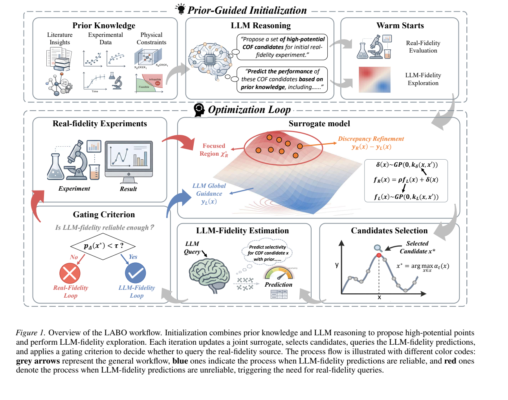
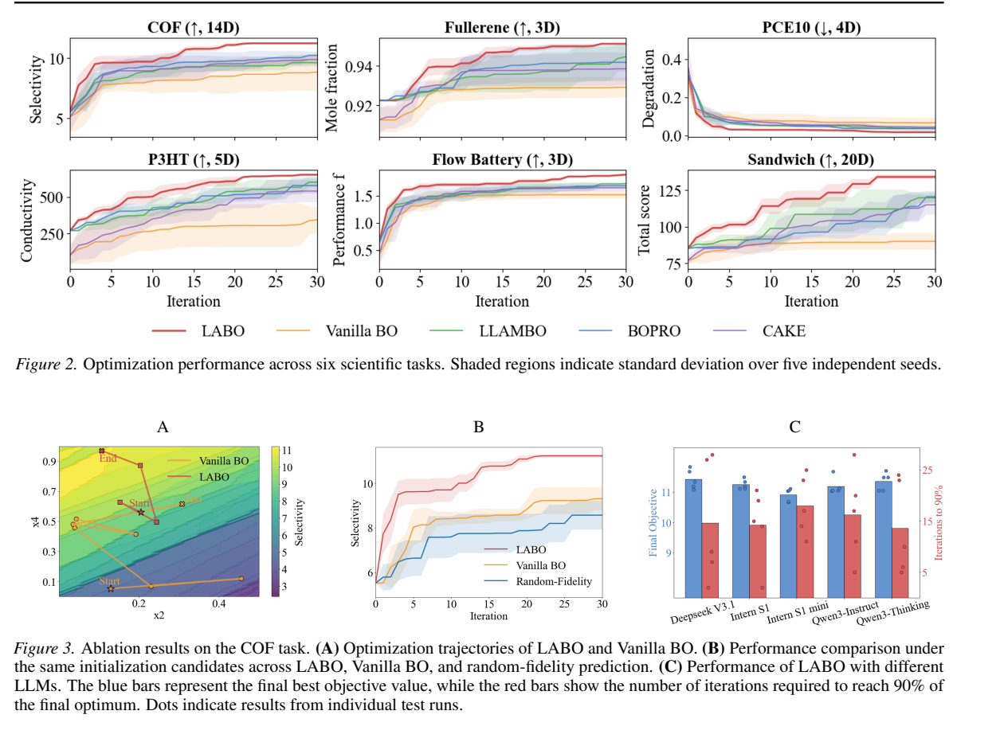
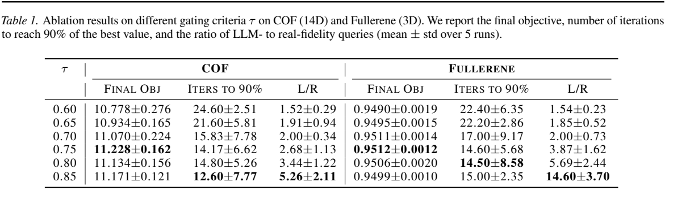

<h1 align="center">LABO</h1>

<h3 align="center">LLM as a Low-Fidelity Oracle for Bayesian Optimization</h3>

<p align="center">
  <b>Broad LLM-fidelity exploration with selective high-fidelity experimentation.</b>
</p>

<p align="center">
  
  
  
  
</p>

<p align="center">
  <a href="#quick-start">Quick Start</a> |
  <a href="#how-labo-works">Method</a> |
  <a href="#results-at-a-glance">Results</a> |
  <a href="#api-configuration">API</a> |
  <a href="#using-your-own-task">Custom Tasks</a> |
  <a href="#project-structure">Project Structure</a>
</p>

<p align="center">
  
</p>

---

## What is LABO?

**LABO** is a Bayesian optimization framework that treats a Large Language Model as an inexpensive low-fidelity oracle. Scientific optimization often has severe high-fidelity data scarcity: real experiments are expensive, slow, and difficult to repeat. LABO uses cheap LLM predictions to explore the design space broadly, while reserving high-fidelity evaluations for candidates where the surrogate is uncertain about the LF-HF discrepancy.

The core idea follows the paper: instead of using the LLM only for warm starts or direct candidate proposals, LABO integrates LLM-fidelity observations into the BO loop through a Kennedy-O'Hagan multi-fidelity surrogate. The optimizer then decides whether each new candidate should receive a low-fidelity LLM update or a high-fidelity experimental evaluation.

In plain terms: LABO lets the LLM sketch a broad map of the search space, while the Bayesian optimizer decides where real experiments are worth spending.

This public research release includes:

- core LABO low-fidelity prediction utilities;
- Kennedy-O'Hagan fusion with a low-fidelity GP and residual GP;
- discrepancy-based gating for high- versus low-fidelity updates;
- EI and UCB acquisition support;
- paper figures extracted from `LABO.pdf` for method and result overview;
- an offline synthetic smoke test that requires no private data and no network call.

Private task assets, raw data records, comparison-study scripts, generated outputs, and domain-specific prompt text are intentionally excluded.

---

## Why LABO?

| Challenge in scientific BO | LABO design choice |
|---|---|
| High-fidelity observations are scarce and expensive. | Use LLM predictions as low-cost low-fidelity observations. |
| Early BO has too little data to build a reliable surrogate. | Query the LLM broadly to improve global coverage before spending many real evaluations. |
| LLM predictions can be biased or miscalibrated. | Learn a residual GP that models the LF-HF discrepancy. |
| Direct LLM proposals can be brittle. | Keep the GP posterior and acquisition function in control of candidate selection. |
| LLM guidance should not replace real evidence. | Trigger high-fidelity evaluations when discrepancy uncertainty dominates. |

---

## How LABO works

LABO models the high-fidelity objective with a Kennedy-O'Hagan decomposition:

```text
f_H(x) = rho * f_L(x) + delta(x)
```

where `f_L` is the LLM-fidelity signal, `rho` calibrates the global LF-HF scale, and `delta` is a residual process learned from high-fidelity observations.

The fused posterior combines:

```text
mean_H(x) = rho * mean_L(x) + mean_delta(x)
var_H(x)  = rho^2 * var_L(x) + var_delta(x)
```

LABO then uses the residual-variance share as a discrepancy gate:

```text
ratio(x) = var_delta(x) / var_H(x)
```

If `ratio(x)` is high, LABO requests a high-fidelity evaluation. Otherwise, it uses a low-fidelity LLM prediction to continue exploring at lower cost.

### Loop structure

1. **Prior-guided warm start**: initialize with fixed or LLM-proposed points.
2. **LLM-fidelity exploration**: query the LLM over additional low-cost candidates.
3. **KOH surrogate fit**: train a low-fidelity GP, estimate `rho`, and fit a residual GP.
4. **Candidate acquisition**: select candidates with EI or UCB under the fused posterior.
5. **Discrepancy gate**: compute the residual-variance share of posterior uncertainty.
6. **Selective evaluation**: use LF predictions when reliable, or trigger HF evaluation when needed.
7. **Repeat**: update the history and refit the fused model.

---

## Results at a glance

The public release does not include private task assets, raw task records, or comparison-study runners. The figures below are extracted from `LABO.pdf` and summarize the paper experiments.

### Optimization and ablation results

<p align="center">
  
</p>

The paper reports that LABO improves sample efficiency across multiple scientific optimization settings under fixed high-fidelity budgets. Figure 2 summarizes optimization trajectories against BO and LLM-assisted baselines. Figure 3 reports ablations showing that both LLM-fidelity exploration and discrepancy-aware fidelity selection contribute to the final performance.

### Fidelity gating threshold

<p align="center">
  
</p>

The discrepancy threshold controls how aggressively LABO requests high-fidelity evaluations. The main experiments use a fixed threshold of `0.75`, balancing final objective quality, iteration efficiency, and the ratio of LLM-fidelity to high-fidelity queries.

> Note: these are paper figures, not raw private task records.

---

## Quick start

### 1. Create the environment

```bash
pip install -r requirements.txt
```

If you already have a compatible PyTorch and GPyTorch environment, you can use it directly.

### 2. Run an offline smoke test

This checks the LABO optimizer path without calling an LLM:

```bash
python examples/synthetic_smoke.py
```

Expected output:

```text
LABO_SYNTHETIC_SMOKE_OK
```

Outputs are written to `results/synthetic_smoke/`, which is ignored by git.

---

## API configuration

LABO can call Intern S1 through environment variables. Do not commit keys.

Windows PowerShell:

```powershell
$env:INTERN_S1_API_KEY="your_key_here"
```

Bash:

```bash
export INTERN_S1_API_KEY="your_key_here"
```

The default endpoint is:

```text
https://chat.intern-ai.org.cn/v1/messages
```

Override it with:

```bash
export INTERN_S1_API_URL="https://your-endpoint/v1/messages"
```

For offline checks, use `examples/synthetic_smoke.py`; it uses a deterministic fake LLM.

---

## Using your own task

Provide:

- `feature_names`: ordered input names;
- `feature_types`: `"float"` or `"int"` for each feature;
- `bounds`: an array shaped `(d, 2)`;
- `hf_blackbox.evaluate(point_dict) -> float`;
- an LLM client with `generate(prompt, seed=None, temperature=..., top_p=..., max_tokens=...) -> str`.

Then instantiate `KOHOptimizer` and call `run(...)`.

Minimal sketch:

```python
from types import SimpleNamespace
from koh.optimizer import KOHOptimizer

optimizer = KOHOptimizer(
    task_name="my_task",
    task_data_dir="results/my_task",
    feature_names=["x1", "x2"],
    feature_types=["float", "float"],
    bounds=bounds,
    target_name="objective",
    llm_client=llm_client,
    hf_blackbox=hf_blackbox,
    llm_config=SimpleNamespace(temperature=0.0, top_p=1.0, max_tokens=512),
    koh_config=SimpleNamespace(
        n_candidates=100,
        mismatch_threshold=0.75,
        gp_training_iter=25,
        max_loops=10,
        acquisition_type="ucb",
        acquisition_beta=1.0,
    ),
)
optimizer.run(max_iterations=5, n_initial_points=3, q=1, fixed_initial_points=initial_points)
```

The public code is deliberately generic; plug in your own high-fidelity evaluator and domain prompt.

---

## Project structure

```text
.
|-- API/                    # Public LLM client wrappers and environment-based config
|-- koh/                    # KOH fusion, acquisition, gating, data management, and optimizer
|-- low_fidelity/           # Public low-fidelity prompt, parser, prediction, and warmup tools
|-- examples/
|   `-- synthetic_smoke.py  # Offline smoke test with deterministic fake LLM responses
|-- assets/                 # README figures cropped from LABO.pdf
|-- LABO.pdf                # Paper source for README method/result figures
|-- requirements.txt
|-- .env.example
`-- README.md
```

## Citation

If you use this code in your research, please cite:

```bibtex
@article{chen2026labo,
  title={LABO: LLM-Accelerated Bayesian Optimization through Broad Exploration and Selective Experimentation},
  author={Chen, Zhuo and Yuan, Xinzhe and Zhang, Jianshu and Dong, Jinzong and Zhou, Ruichen and Niu, Yingchun and Zhou, Tianhang and Liu, Yu Yang Fredrik and Li, Yuqiang and Ye, Nanyang and others},
  journal={arXiv preprint arXiv:2605.22054},
  year={2026}
}
```
